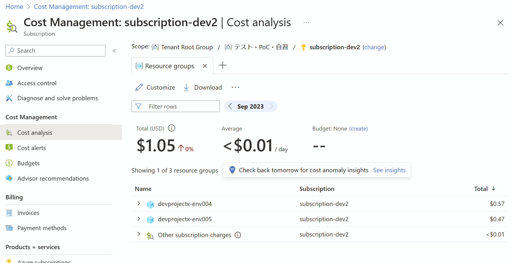

# 配置された環境の管理

作成した環境については、管理者が適宜管理する必要があります。主な管理作業としては以下があります。

- 環境一覧管理
- 環境の削除
- コスト管理（課金管理）

## 環境一覧管理

現在作成されている環境の一覧は、az cli （または REST API）から取得できます。誰がどのテンプレートから作成したのかもわかります。

```bash

# 作成した環境一覧は、管理者でなくても取得できる
if ${FLAG_USE_SOD} ; then az account clear ; az login -u "user_projectx_user1@${PRIMARY_DOMAIN_NAME}" -p "${ADMIN_PASSWORD}" ; fi

TEMP_LOCATION_NAME=${LOCATION_NAMES[0]}
TEMP_LOCATION_PREFIX=${LOCATION_PREFIXS[0]}
TEMP_DC_NAME="dc-devcenter-${TEMP_LOCATION_PREFIX}"
TEMP_PRJ_NAME="DevProject-SpokeX"

az devcenter dev environment list --dev-center-name "${TEMP_DC_NAME}" --project-name "${TEMP_PRJ_NAME}"

```

| catalogName                             | environmentDefinitionName | environmentType | error | name  | parameters | provisioningState | resourceGroupId                                                                         | user                               |
|-----------------------------------------|---------------------------|-----------------|-------|-------|------------|-------------------|------------------------------------------------------------------------------------------|------------------------------------|
| AzureCAF.LandingZones.Demo.DepEnvTemplates | Sandbox-Empty             | Sandbox         | null  | env001| {}         | Succeeded         | /subscriptions/570ffec8-01c4-4f69-8635-bada97215d86/resourceGroups/devprojectx-env001     | 9e78363b-ea6f-4b97-a1cf-8484617b3a8f |
| AzureCAF.LandingZones.Demo.DepEnvTemplates | Sandbox-Empty             | Sandbox         | null  | env002| null       | Succeeded         | /subscriptions/570ffec8-01c4-4f69-8635-bada97215d86/resourceGroups/devprojectx-env002     | 25d9f9ad-25c6-418a-9071-2a0eaf86cc4d |
| AzureCAF.LandingZones.Demo.DepEnvTemplates | Sandbox-Empty             | Sandbox         | null  | env003| {}         | Succeeded         | /subscriptions/570ffec8-01c4-4f69-8635-bada97215d86/resourceGroups/devprojectx-env003     | 2093c334-2c7f-4067-85e0-0573711cc1e5 |

## コスト管理（課金管理）

Cost Management ツールを利用して行います。リソースグループ単位に課金額を表示するようにすると便利な他、csv ファイルへのエクスポートも便利（定期的なエクスポートも可能）です。（利用者情報との突合せに関しては別途手作業で行う必要があります。）

  

想定外のコスト増を防ぐため、コストアラートの設定をオススメします。コストアラートには以下の 2 種類があり、いずれもこの画面から設定することができます。

- 予算アラート（Budget Alert）
  - 特定期間内に特定予算に到達した（あるいは到達する見込みになった）場合にアラートを発報する
- 異常アラート（Anormaly Alert）
  - 特定期間内に特定の異常なコスト増（あるいはコスト減）が発生した場合にアラートを発報する

なお、コストアラートはサブスクリプションスコープでのみの設定になります。もともと環境は動的に作成／削除されますので、サブスクリプション全体でアラートを仕掛けるのが適切ですが、もしリソースグループ単位に特定金額を超えたら何かをしたい、という場合には、上記のエクスポート機能と組み合わせた機能開発が必要になります。
## 配置された環境の削除

「配置された環境は不要になったら削除する」のがルールですが、要求者がそのまま放置してしまう場合もあります。また、作成した後に長期間放置された環境は、未適用セキュリティパッチが発生するなど脆弱な環境になりやすいリスクもあります。このため、**配置された環境に関しては定期的に削除する**ことをオススメします。

具体的には「作成後、2週間以上が経過している環境は強制的に削除する」などのルールを設けておき、これに沿って環境を削除するとよいでしょう。一方難点として、当該環境がいつ作成されかのかは、前述の az cli コマンドからは現在入手できません（製品チームに[機能追加要望中](https://developercommunity.visualstudio.com/t/Add-created-datetime-to-environment/10458609)）。これは以下のいずれかの方法で調べることができます。

- Activity Log からリソースグループ作成の情報を拾う
- DevCenterDiagnosticLogs から Microsoft.DevCenter/projects/users/environments/write の情報を拾う

いずれの方法も、アクティビティログやリソース診断ログを Log Analytics ワークスペースにエクスポートしておく必要があります。

### Activity Log からリソースグループ作成の情報を拾う

Activity Log を Log Analytics ワークスペースにエクスポートしている場合には、以下のクエリで調べることができます。ただしこの方法は Log Analytics ワークスペースに対してワークスペースアクセス権限を持っていないと使うことができないため、大企業などでは利用しづらいです。

- 下記クエリを、**Log Analytics ワークスペースに対して**実行する

```LAW KQL

AzureActivity
| where SubscriptionId =~ "570ffec8-01c4-4f69-8635-bada97215d86"
| where OperationNameValue =~ "MICROSOFT.RESOURCES/SUBSCRIPTIONS/RESOURCEGROUPS/WRITE"
| where ActivityStatusValue =~ "Success"
| project ResourceGroup, Caller, TimeGenerated
| order by ResourceGroup asc

```

  

### DevCenterDiagnosticLogs から Microsoft.DevCenter/projects/users/environments/write の情報を拾う

DevCenter のリソース診断ログを Log Analytics ワークスペースにエクスポートしている場合にはこの方法も利用できます。こちらの方法では、リソースコンテストアクセスが利用できるため、Log Analytics ワークスペースに対してワークスペースアクセス権限を持っていなくても利用できます。

- 下記クエリを、**DevCenter のログ検索画面から**実行する

```LAW KQL

DevCenterDiagnosticLogs
| where OperationName startswith "Microsoft.DevCenter/projects/users/environments/"
| where OperationResult =~ "Success"
| where TimeGenerated > ago(30d) 
| extend segments = split(TargetResourceId, "/")
| extend EnvironmentOperationType = split(OperationName, "/")[4]
| project TimeGenerated,
          EnvironmentName = tostring(segments[10]),
          EnvironmentOperationType,
          UserId = tostring(segments[8]),
          SubscriptionId = tostring(segments[2]),
          DevCenterName = tostring(segments[4]),
          ProjectName = tostring(segments[6]),
          TargetResourceId
| order by TimeGenerated desc

```

  

上記のような方法で削除してよい環境を見つけたら、下記のコマンドラインで削除します。

```bash

# DevCenter の日常運用アカウントでアクセス
if ${FLAG_USE_SOD} ; then az account clear ; az login -u "user_dev1_ops@${PRIMARY_DOMAIN_NAME}" -p "${ADMIN_PASSWORD}" ; fi

TEMP_LOCATION_NAME=${LOCATION_NAMES[0]}
TEMP_LOCATION_PREFIX=${LOCATION_PREFIXS[0]}
TEMP_DC_NAME="dc-devcenter-${TEMP_LOCATION_PREFIX}"
TEMP_PRJ_NAME="DevProjectX"
TEMP_ENV_NAME="env005"

# 他のユーザが作成した環境の場合は user-id の指定が必要
TEMP_USER_ID=$(az devcenter dev environment list --dev-center-name ${TEMP_DC_NAME} --project-name ${TEMP_PRJ_NAME} --query "[?name=='${TEMP_ENV_NAME}'].user" -o tsv)

az devcenter dev environment delete --dev-center-name ${TEMP_DC_NAME}  --name ${TEMP_ENV_NAME} --project-name ${TEMP_PRJ_NAME} --user-id ${TEMP_USER_ID}

```
