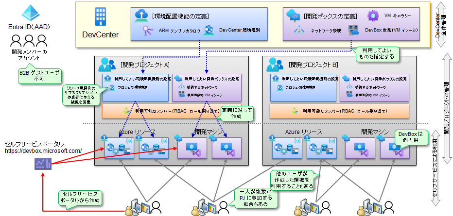
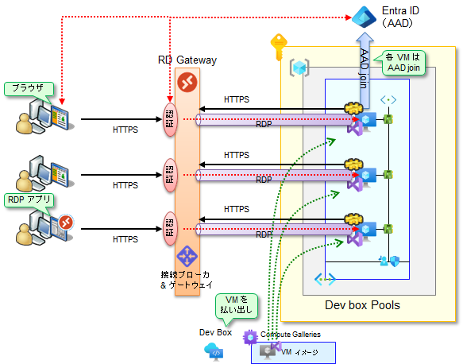
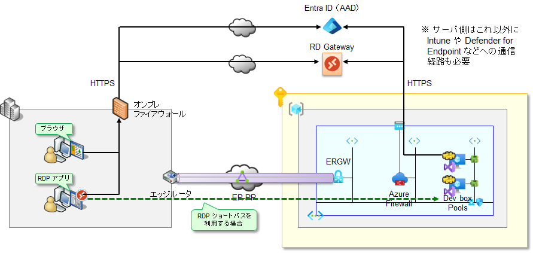
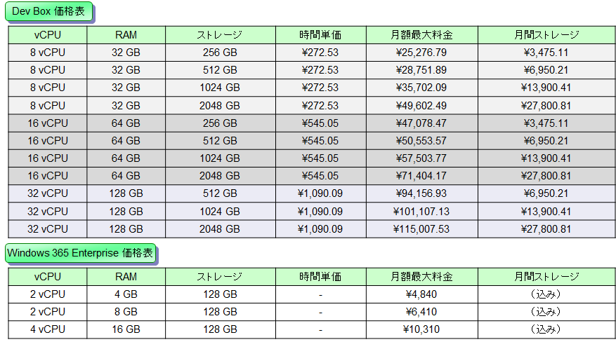

# DevBox の作成について

DevBox は、開発者からの要求に応じて、（開発ツールが事前にインストールされた）仮想マシンを自動作成し、要求者に利用してもらうサービスです。すでに説明している環境配置機能（Deployment Environments）と同様に、DevCenter 配下に開発プロジェクトを作成し、利用可能な開発ボックス（開発用仮想マシン）を定義しておくことにより、開発者がセルフサービスで開発用 VM を作成・利用できるようになります。

  

## DevBox の動作アーキテクチャ

DevBox は Windows 365 や Azure Virtual Desktop などの技術を活用して構築されているため、ネットワークなどを始めとするアーキテクチャはこれらと基本的に同一です。ポイントは以下の通りです。

  

- 開発ボックス（各 VM）は 指定した VNET（の中の指定したサブネット）に収容される
  - 開発ボックスとして作成された VM は、事前に指定したサブネットに収容されます。このサブネットに NSG, UDR などをつけることにより、ネットワーク閉域化もできます。（ただし Entra ID や RD Gateway, MDE など複数のサービスへの outbound 接続が必要です。通信要件は[こちら](https://learn.microsoft.com/ja-jp/windows-365/enterprise/requirements-network)。）
  - AAD join（後述）で利用する場合、オンプレミスとの接続は不要です。このため、浮島的な利用方法も可能です。
- クライアントからの接続は RD Gateway 経由で行われる
  - エンドユーザは、ブラウザまたは RDP アプリを利用して開発ボックスに接続します。開発ボックスへの接続は、（マイクロソフトが管理している）RD Gateway を経由して行われます。
  - RD Gateway を仲介した開発ボックス（ホストマシン）へのアクセスは、HTTPS で行われます。各 VM 内のエージェントが RD Gateway に HTTPS で接続（outbound 接続）し、クライアント側からは RD Gateway に HTTPS で接続すると、RD Gateway の仲介（トンネル接続）によりホストへ通信できるようになります。
- 各ホストマシンは Entra ID （Azure AD）に AAD join させる
  - これにより、各ユーザは Azure AD 認証により VM にログインすることができるようになります。
  - なお、Entra ID がオンプレ AD と連携しており、かつ開発ボックスからオンプレリソースにも接続させたい（＝オンプレ AD 参加したい）場合には、Hybrid AAD join を行うことも可能です。ただしこの場合は VNET 内に（VM をドメイン参加させるための）ドメインコントローラが必要です。
- RDP 通信のショートカット接続も可能
  - クライアントと VM が直接通信できる環境にいる場合は、ショートカット接続も可能です。RDP ショートパスと呼ばれる技術で、詳細は[こちら](https://learn.microsoft.com/ja-jp/windows-365/enterprise/rdp-shortpath-public-networks)と[こちら](https://learn.microsoft.com/ja-jp/azure/virtual-desktop/rdp-shortpath)のページに記載されています。
  - なお、RDP ショートパスを利用する場合でも、接続ネゴシエーションのため、RD Gateway への接続は必要です（セッション確立後、直接通信に切り替えます）。このため、RDP ショートパスを利用したとしても outbound 接続は必須です。

## ネットワーク構成要件について

前述の通り、開発ボックスは RD Gateway を使って RDP 通信をトンネリングさせることにより、クライアントと開発ボックス間の画面転送を実現しています。クライアント側がオンプレミス（＝ファイアウォールの内側）にいる場合には、オンプレファイアウォールに穴を開け、RD Gateway（に加えてセルフサービスポータルや Entra ID など）に対する outbound 接続を許可する必要があります。

またこの場合、開発ボックスを作成する Azure 上の VNET とオンプレミスのネットワークは、Express Route や S2S VPN などにより接続する方法と、敢えて接続せずに使う（＝オンプレミスから隔離された環境に開発ボックスを作成する）方法の 2 通りがあります。どちらの方式にすべきかは、後述するユースケースによって変わります。

  

## DevBox の価格体系について

DevBox と Windows 365 はいずれも仮想デスクトップサービスですが、類似点と共にいくつかの相違点もあります。

- 主な類似点
  - ほぼ同一アーキテクテャで稼働する仮想デスクトップサービスであること
  - どちらも VM 占有型で稼働する（＝AVD のようなマルチセッション機能はない）
  - 別途いくつかのライセンス調達が必要（DevBox の場合の詳細は[こちら](https://azure.microsoft.com/ja-jp/pricing/details/dev-box/)を参照）
- 主な相違点
  - Windows 365 は 2～4 vCPU, DevBox は 8～32 vCPU のマシンが利用可能
  - Windows 365 は月額固定料金、DevBox は天井付きの従量課金料金
  - DevBox の利用料金は Azure 利用料金として請求される

特に料金体系には注意が必要です。下表は 2023/09/13 時点の価格ですが（最新価格は Web でご確認ください）、DevBox のマシンや価格設定には以下のような特性があることがわかります。

  

- ハイスペックマシンしか用意されていない。
  - これは DevBox が Visual Studio のような「重たい」開発ツールを動作させることを想定しているためです。最近では Visual Studio Code のような「軽いエディタ」であっても、裏側で動いている SDK が非常に重たいために、ハイスペックマシンが必要になることがあります。
  - 逆に言えば、軽いエディタだけを動作させたいようなユースケースであれば、他の技術の方が適している場合もあります。（例：Windows 365, AVD マルチセッションなど）
- 価格は天井付きの従量課金料金。
  - 計算してみるとわかりますが、約 80 時間の利用で天井に達します。この天井価格は、対応する仮想マシンの 1year RI（リザーブドインスタンス）程度の割引相当の金額です。また、1 日 8 時間の利用 × 20 日 = 160 時間と比べると、かなり安価に利用できることがわかります。
- ROI（投資対効果）はキッティング作業やメンテナンスコスト、ハードウェア輸送費なども含めて考える必要がある。
  - DevBox はサーバハードウェア上で動作しているため、ノート PC などと比べると絶対的な金額としては必ずしも安価には見えないところがあります。例えば 8vCPU/32GB/256GB ストレージのマシンを半年利用すると約 15 万円になりますが、この金額単体で見るとそんなに安く見えない、という方もいると思います。
  - 一方、DevBox を利用すると、例えばニアショア開発時に開発 PC を調達・配送する必要がなかったり、開発 PC のセットアップやリセットが簡単だったり、開発 PC の資産管理やセキュリティ管理が組み込まれていたりと、開発 PC の管理作業・メンテナンス作業を大きく低減させることが可能です。

DevBox は「管理された開発 PC 環境を作る」ためのツールであることを考えると、単純なハードウェア費用と比較するのはナンセンスですし、逆に言えば、これらの特性が活かせるような場所で DevBox を利用すると、その効果を最大限に発揮することができます。

## DevBox の主なユースケースについて

以上を念頭におくと、特に DevBox を役立てやすいユースケースとしては以下のようなものがあります。

  

- ① 一時的にハイスペックマシンを利用する。
  - 社給 PC は 8 コア 16 GB 以下のマシンであることが多く、Visual Studio や Eclipse でガッツリと開発するにはスペック不足（特にメモリ）であり、それだけで作業効率・開発生産性を著しく損ないます（デベロッパーには基本的人権としてハイスペックマシンを！ と叫ばれる所以です）。
  - このような場合、DevBox を利用することで、ハイスペックマシンを一時的に利用することができます。短時間の利用であれば、従量課金利用になるので安価に済ませることができます。
- ② ニアショア・オフショア開発で DevBox を提供する。
  - 特に大企業では、セキュリティ上の理由から、開発者を一つの大きな部屋に集め、閉鎖環境で開発作業に従事する、いわゆる大部屋開発がよく行われてきました。現在でも、金融・公共・製造などではこのような開発スタイルが多く見られますが、こうした昔ながらの開発スタイルをニアショア・オフショア開発に広げようとすると、物理的な開発 PC の提供・輸送などが必要になり、管理性の悪化や作業コストの増大につながります。
  - このような場合には、DevBox を利用して、ニアショア・オフショア開発ベンダーに対する開発端末の提供を行うとよいでしょう。これにより、物理的な開発 PC の提供・輸送などが不要になる他、管理性も向上します。
  - （参考）このようなリモートワークシナリオでの利用に際しては、**誰のどの端末から DevBox を利用するのか** についても注意が必要です。DaaS/VDI の利用では、アクセス元となる端末が適切にエンドポイント保護されていることが必要です（例：アクセス元となる端末が自宅 PC で、その端末がマルウェア汚染されており、定期的に画面スナップショットを取得して外部に送信するようなものだった場合には、DevBox を使っていてもセキュリティが担保されない、ということになってしまいます）。このためこのシナリオの場合、ニアショア・オフショア開発ベンダーの社給 PC が一定のセキュリティ要件を満たしており、それがアクセス元の端末として転用できる、という前提条件が必要になります。
- ③ PoC 開発で利用する。
  - 特に大企業では、社給 PC には様々な制限がかけられている場合が多く、インターネットの著名な Web サイトにすら自由にアクセスできなくなっていることが少なくありません。これ自体はフィッシング被害などを防ぐために必要な措置とはいえ、開発者にとっては不便な制限であることが多いです。このような場合、従来は、別途 PC を調達し、ネットワーク回線を契約して利用する、といった面倒なことをしていましたが、このような端末は部門調達であることが多く、IT の管理を離れた野良端末になりやすいというデメリットを抱えていました。
  - DevBox を利用すると、現在のネットワーク環境とは切り離した「浮島」環境に開発ボックスを作成し、利用することができます。オンデマンドで作成・利用できるだけでなく、この「浮島」を閉域化したり、外部通信をすべて Azure Firewall で監視することもできるため、管理・統制が容易になります。

## 本資料で構築する環境について

上記を踏まえて、以降の説明では、③のユースケースを想定した DevBox を構築します。ただし、再利用性・転用性を加味して、以下のようなネットワーク構成にします。

- DevBox マシンからの通信は、すべて Azure Firewall を通します。
  - Azure Firewall ではすべての外向き通信を許可しますが、通信ログをすべて取るようにします。
  - 後から容易に閉域化できるように、「DevBox に必要な通信」を許可した上で、さらに「任意の通信」を許可するように設定します。（これにより、通信ログの解析も容易になります。）
- 拡張性を加味して、Hub-Spoke 構成で環境を構築します。
  - オンプレミスから見て浮島環境になるため、単一 VNET で構成しても問題ありませんが、拡張性を考慮して、Hub-Spoke 構成で構築します。

なお DevCenter や開発プロジェクトに関しては、作業ステップ 71-01～05 で作成されたものを利用します。もちろん、作業ステップ 72～73 の Deployment Environments が存在していても問題なく作業を進めることが可能です。

  
