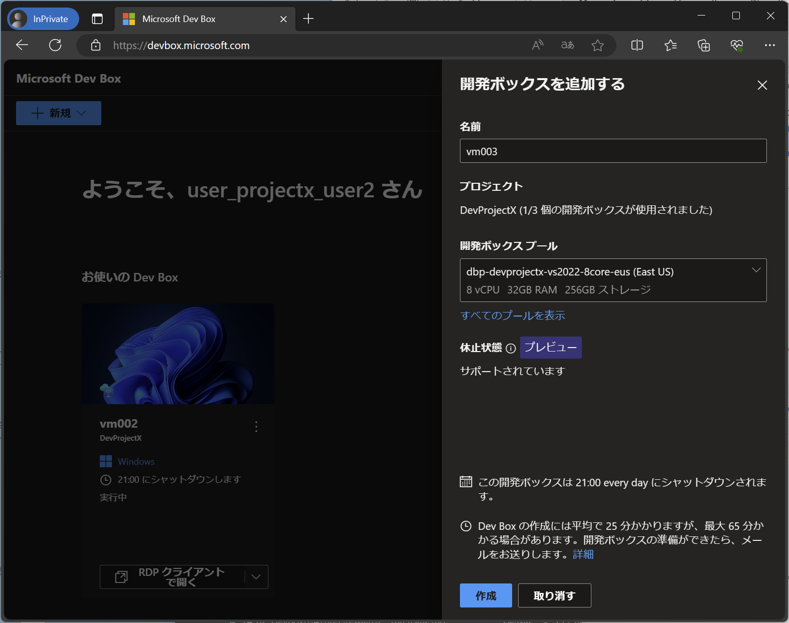
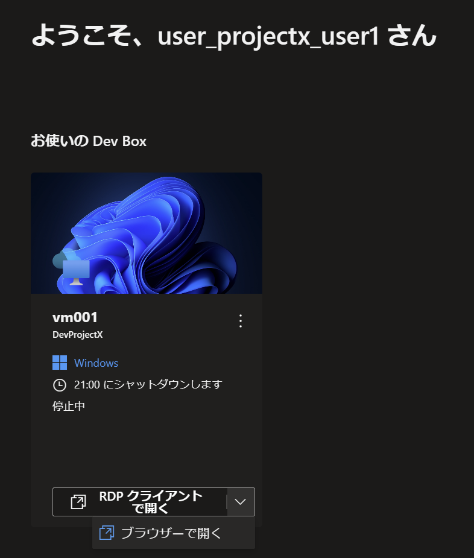

# DevBox 作成のテスト

以上の作業が終わったら、開発プロジェクトメンバーのアカウントでセルフサービスポータルにアクセスし、開発ボックスを要求してください。

## ユーザアカウントについて

以下のスクリプトで、ログインに利用するユーザアカウントを取得しておいてください。

```bash

cat <<EOF
user_projectx_user1@${PRIMARY_DOMAIN_NAME}
user_projectx_user2@${PRIMARY_DOMAIN_NAME}
user_projectx_user3@${PRIMARY_DOMAIN_NAME}
user_projectx_admin@${PRIMARY_DOMAIN_NAME}
user_projecty_user1@${PRIMARY_DOMAIN_NAME}
user_projecty_user2@${PRIMARY_DOMAIN_NAME}
user_projecty_user3@${PRIMARY_DOMAIN_NAME}
user_projecty_admin@${PRIMARY_DOMAIN_NAME}
EOF

```

## セルフサービスポータルからの DevBox VM の作成

上記のユーザアカウントでセルフサービスポータル（https://devbox.microsoft.com/）にログインし、開発ボックスを作成してください。

※ VM の作成にはかなりの時間がかかります（数10分～1時間以上）。これは VM 作成後に、ドメイン参加や Intune 登録などが行われるためです。DevCenter API（後述）を利用して管理者側で事前に VM を作成しておき、これを使ってもらうこともできます。

  

## VM へのログイン

作成し終わった VM へは、ブラウザからログインすることも、あるいは RDP デスクトップアプリからログインすることもできます。（後者の方がレスポンスに優れているため、アプリのインストールが可能であれば RDP デスクトップアプリから利用することをオススメします）

  

## OS の日本語化

今回、開発ボックスの VM イメージはマイクロソフトが用意した英語版のものをそのまま利用しています。このため日本語化したい場合には、VM 作成後にいくつかの言語パックを適用する必要がありますが、これは比較的簡単に実施できます。ログイン後、以下の作業を行ってください。

- Windows OS の日本語化
  - Settings > Time & Language > Language & Region > Preferred languages > Add a language > 日本語（※ 要リブート）
- Office の日本語化
  - Options > Office display language > Japanese (日本語) > Install available から入手してインストール
- Visual Studio の日本語化
  - Tools > Get Tools and Features... > Language pack (言語パック) > Japanese (日本語) > Modify (変更)
  - Tool > Options > Environment > International Settings > Language > Same as Microsoft Windows（または日本語を選択）

## (参考) イメージそのもののカスタマイズ

上記の作業をいちいち開発者に行わせたくない場合や、他のツールをイメージの中に取り込んでおきたいような場合には、VM イメージのカスタマイズを行います。カスタマイズには AIB (Azure VM Image Builder)を利用します。実施方法は下記を参照してください。

- [Azure VM Image Builder を使用して開発ボックスを構成する](https://learn.microsoft.com/ja-jp/azure/dev-box/how-to-customize-devbox-azure-image-builder)
