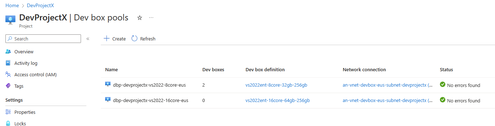
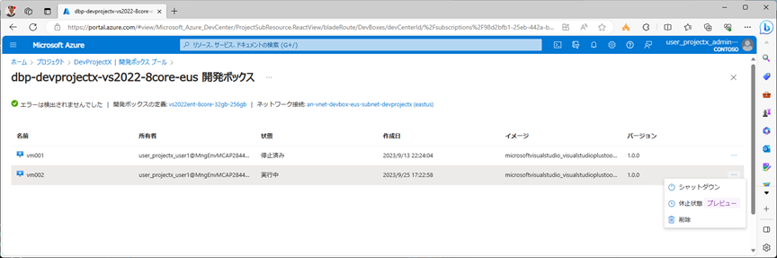
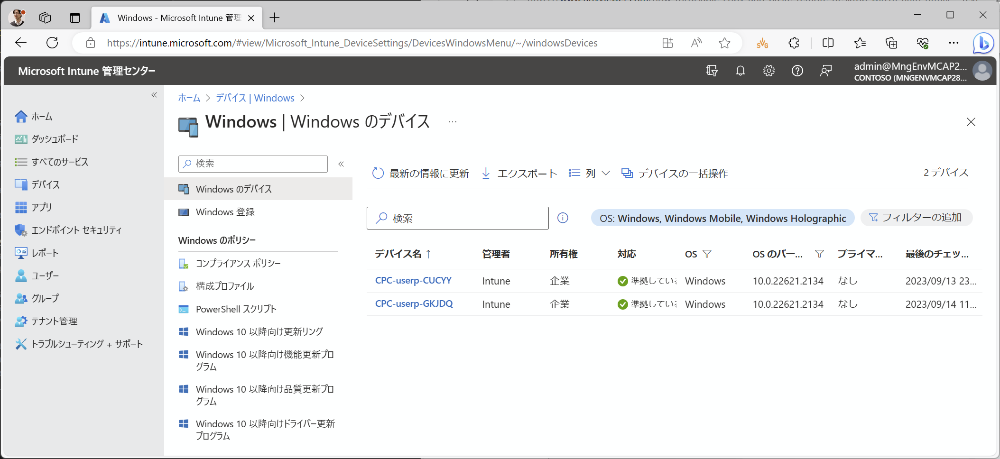
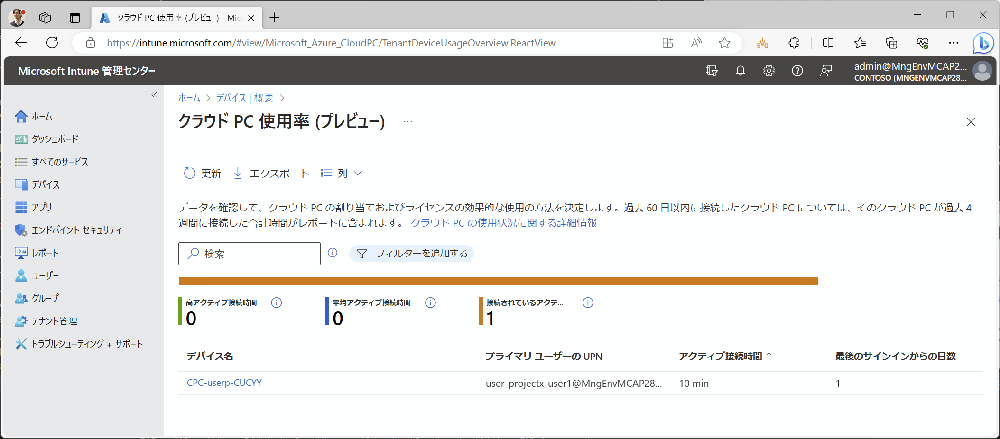

# DevBox プールの VM 管理

DevBox プールの中に作成された VM に対する主な管理作業として、以下を解説します。

- プール内の VM 数を確認する
- プール内の VM の一覧を確認する
- プール内の VM の利用状況を確認する
- プール内での VM の作成と削除の履歴を確認する
- 特定のユーザが作成した VM を管理者が強制削除する

## プール内の VM 数を確認する

プール内の VM 総数は、Azure Portal またはコマンドラインから確認できます。

```bash

if ${FLAG_USE_SOD} ; then az account clear ; az login -u "user_projectx_admin@${PRIMARY_DOMAIN_NAME}" -p "${ADMIN_PASSWORD}" ; fi

TEMP_LOCATION_NAME=${LOCATION_NAMES[0]}
TEMP_LOCATION_PREFIX=${LOCATION_PREFIXS[0]}
TEMP_RG_NAME="rg-devcenter-${TEMP_LOCATION_PREFIX}"
TEMP_DC_NAME="dc-devcenter-${TEMP_LOCATION_PREFIX}"
TEMP_PRJ_NAME="DevProjectX"

az rest --method GET --uri "/subscriptions/${SUBSCRIPTION_ID_DEV1}/resourceGroups/${TEMP_RG_NAME}/providers/Microsoft.DevCenter/projects/${TEMP_PRJ_NAME}/pools?$top=50&$skip=0&api-version=2023-06-01-preview"

```

  

## プール内の VM の一覧を確認する

以下の 3 つの方法で VM 一覧を取得できます。

- Azure Portal
- DevCenter REST API
- Intune ポータル

### Azure Portal

Azure Portal から開発ボックスプールの詳細を確認すると、プール内の VM 一覧を確認できます。この際、**DevCenter や開発プロジェクトに対して Owner, Contributor などの権限を有しているだけでは一覧が取得できない**点に注意してください。開発プロジェクトに対して管理者権限をもっている（**DevCenter Project Admin ロールを保有している**）ユーザアカウントで Azure Portal にログインすると、下図のように VM 一覧を確認することができます。（次に説明する DevCenter REST API についても同様です。）

  

### DevCenter REST API

DevCenter API を利用すると、開発プロジェクトに属する VM の一覧を取得できます。詳細情報も含まれているため、各種の検索を行うことも可能です。

```bash

# 開発プロジェクトの管理者権限 (DevCenter Project Admin ロール)に属するユーザアカウントで作業
az login -u "user_projectx_admin@${PRIMARY_DOMAIN_NAME}" -p "${ADMIN_PASSWORD}"

TEMP_LOCATION_NAME=${LOCATION_NAMES[0]}
TEMP_LOCATION_PREFIX=${LOCATION_PREFIXS[0]}
TEMP_RG_NAME="rg-devcenter-${TEMP_LOCATION_PREFIX}"
TEMP_DC_NAME="dc-devcenter-${TEMP_LOCATION_PREFIX}"
TEMP_PRJ_NAME="DevProjectX"
TEMP_DBP_NAME="dbp-devprojectx-vs2022-8core-${TEMP_LOCATION_PREFIX}"

# DevCenter API を使う場合には、まず DevCenter URI を拾う
# 例）https://5f335032-b138-4484-8436-45b77a200855-dc-devcenter-eus.eastus.devcenter.azure.com/
TEMP_DC_URI=$(az rest --method GET --uri "/subscriptions/${SUBSCRIPTION_ID_DEV1}/resourceGroups/${TEMP_RG_NAME}/providers/Microsoft.DevCenter/projects/${TEMP_PRJ_NAME}?api-version=2023-04-01" --query "properties.devCenterUri" -o tsv)

# DevCenter API から DevBox 一覧を取得　※ 開発プロジェクト管理者権限が必要
az rest --method GET --uri "${TEMP_DC_URI}devboxes?api-version=2023-04-01" --resource https://devcenter.azure.com/
# または az devcenter dev dev-box list --dev-center-name "${TEMP_DC_NAME}"

```

取得される情報は以下の通りです。VM イメージ、SKU サイズ、VM GUID、所属する VM プールなどの他に、作成者、作成日時、現在の VM の状態などが含まれます。

```az cli

[
  {
    "actionState": "Started",
    "createdTime": "2023-09-13T13:24:04.290014+00:00",
    "error": null,
    "hardwareProfile": {
      "memoryGb": 32,
      "skuName": "general_i_8c32gb256ssd_v2",
      "vCpUs": 8
    },
    "hibernateSupport": "Enabled",
    "imageReference": {
      "name": "microsoftvisualstudio_visualstudioplustools_vs-2022-ent-general-win11-m365-gen2",
      "operatingSystem": "Windows11",
      "osBuildNumber": "vs-2022-ent-general-win11-m365-gen2",
      "publishedDate": "2022-09-20T00:00:00+00:00",
      "version": "1.0.0"
    },
    "localAdministrator": "Enabled",
    "location": "eastus",
    "name": "vm001",
    "osType": "Windows",
    "poolName": "dbp-devprojectx-vs2022-8core-eus",
    "powerState": "Running",
    "projectName": "DevProjectX",
    "provisioningState": "Succeeded",
    "storageProfile": {
      "osDisk": {
        "diskSizeGb": 256
      }
    },
    "uniqueId": "37fb8241-bde8-4098-ae6a-ebbd5082361e",
    "user": "9e78363b-ea6f-4b97-a1cf-8484617b3a8f"
  }
]

```

### Intune ポータル

DevBox VM は Windows 365 Cloud PC としてデバイス管理ツールである Intune に登録されているため、デバイス管理ツールである Intune から作成されている VM を確認することができます。（ただし Windows 365 を利用している場合にはそちらも表示されます。）

  

## プール内の VM の利用状況を確認する

また Intune の機能として、誰がどのデバイスを利用したのかの情報も表示することができます。（デバイス > クラウド PC パフォーマンス > クラウド PC 使用率 から確認できます）

  

## プール内での VM の作成と削除の履歴を確認する

プール内の各 VM の作成日時は、VM の一覧を REST API で参照することにより確認できます。

```bash

# 開発プロジェクト内の各プールの VM を作成日時とともに表示する
az devcenter dev dev-box list --dev-center-name "${TEMP_DC_NAME}" --query [].[projectName,poolName,user,name,createdTime,uniqueId] -o tsv

```

| projectName | poolName | user | name | createdTime | uniqueId |
| --- | --- | --- | --- | --- | --- |
| DevProjectX  | dbp-devprojectx-vs2022-8core-eus |       9e78363b-ea6f-4b97-a1cf-8484617b3a8f  |  vm001 |  2023-09-13T13:24:04.290014+00:00  |     37fb8241-bde8-4098-ae6a-ebbd5082361e |
| DevProjectX | dbp-devprojectx-vs2022-8core-eus  |      9e78363b-ea6f-4b97-a1cf-8484617b3a8f | vm002 | 2023-09-25T08:22:58.588065+00:00  |  63b1efdf-ee7d-419f-a373-11f30fa5111f |


他の方法として、DevCenter からの診断ログ出力を有効化している場合には、ログから作成・削除などの履歴を取得することができます。

```KQL クエリ

DevCenterDiagnosticLogs
| where TimeGenerated > ago(30d)
| extend Parts = split(TargetResourceId, "/")
| extend DevProject = Parts[6], UserName = Parts[8], Type = Parts[9],
    VMName = split(Parts[10], ":")[0], OpName2 = split(Parts[10], ":")[1]
| extend Parts2 = split(OperationName, "/")
| extend OpName = Parts2[4]
| extend ParsedCallerIdentity = parse_json(CallerIdentity)
| extend Identity = tostring(ParsedCallerIdentity.ObjectID[0].Identity)
| where Type =~ "DEVBOXES"
| project TimeGenerated, DevProject, UserName, Type, VMName, OpName, OpName2, Identity, OperationResult

```

| TimeGenerated [UTC]      | DevProject  | UserName | Type     | VMName | OpName | OpName2 | Identity                              | OperationResult |
|--------------------------|-------------|----------|----------|--------|--------|---------|---------------------------------------|-----------------|
| 9/13/2023, 2:39:57.625 PM| DEVPROJECTY | ME       | DEVBOXES | VM001  | delete |         | 3892760b-f673-4602-a3dd-b1f538e7b398  | Success         |
| 9/13/2023, 2:39:45.006 PM| DEVPROJECTX | ME       | DEVBOXES | VM001  | action | STOP    | 9e78363b-ea6f-4b97-a1cf-8484617b3a8f  | Success         |
| 9/14/2023, 12:02:30.864 AM|DEVPROJECTX | ME       | DEVBOXES | VM002  | write  |         | 25d9f9ad-25c6-418a-9071-2a0eaf86cc4d  | Success         |
| 9/13/2023, 1:24:04.444 PM| DEVPROJECTX | ME       | DEVBOXES | VM001  | write  |         | 9e78363b-ea6f-4b97-a1cf-8484617b3a8f  | Success         |
| 9/13/2023, 2:05:42.869 PM| DEVPROJECTY | ME       | DEVBOXES | VM001  | write  |         | 3892760b-f673-4602-a3dd-b1f538e7b398  | Success         |

## 特定のユーザが作成した VM を管理者が強制削除する

開発ボックス VM を一台単位で削除するのであれば Azure Portal を使っても可能ですが、退職したメンバーが持っていた VM をまとめて削除したいといった目的であれば、スクリプトを使うのが便利です。それぞれ以下の API を利用します。

- [特定ユーザが作成した VM の一覧を取得する](https://learn.microsoft.com/en-us/rest/api/devcenter/developer/dev-boxes/list-dev-boxes-by-user?tabs=HTTP)
- [プール内の VM を管理者が強制削除する](https://learn.microsoft.com/en-us/rest/api/devcenter/developer/dev-boxes/delete-dev-box?tabs=HTTP)

削除に際しては、以下の情報が必要です。

- DevCenter URI
- 開発プロジェクト名
- DevBox VM の要求者の Object ID
- DevBox VM の名前

```bash

if ${FLAG_USE_SOD} ; then az account clear ; az login -u "user_projectx_admin@${PRIMARY_DOMAIN_NAME}" -p "${ADMIN_PASSWORD}" ; fi

TEMP_LOCATION_NAME=${LOCATION_NAMES[0]}
TEMP_LOCATION_PREFIX=${LOCATION_PREFIXS[0]}
TEMP_RG_NAME="rg-devcenter-${TEMP_LOCATION_PREFIX}"
TEMP_DC_NAME="dc-devcenter-${TEMP_LOCATION_PREFIX}"
TEMP_PRJ_NAME="DevProjectX"
TEMP_DC_URI=$(az rest --method GET --uri "/subscriptions/${SUBSCRIPTION_ID_DEV1}/resourceGroups/${TEMP_RG_NAME}/providers/Microsoft.DevCenter/projects/${TEMP_PRJ_NAME}?api-version=2023-04-01" --query "properties.devCenterUri" -o tsv)

TEMP_USER_NAME="user_projectx_user2@${PRIMARY_DOMAIN_NAME}"

# 当該ユーザの object id を取得
TEMP_USER_OBJ_ID=$(az ad user show --id $TEMP_USER_NAME --query id -o tsv)

# 当該ユーザが保有する VM 一覧を取得
az rest --method GET --uri "${TEMP_DC_URI}projects/${TEMP_PRJ_NAME}/users/${TEMP_USER_OBJ_ID}/devboxes?api-version=2023-04-01" --resource "https://devcenter.azure.com/"

# 全 VM を削除する場合
TEMP_VM_NAMES=$(az rest --method GET --uri "${TEMP_DC_URI}projects/${TEMP_PRJ_NAME}/users/${TEMP_USER_OBJ_ID}/devboxes?api-version=2023-04-01" --resource "https://devcenter.azure.com/" --query "value[].name" -o tsv)

for TEMP_VM_NAME in $TEMP_VM_NAMES; do

echo "Deleting ${TEMP_USER_NAME} ${TEMP_VM_NAME}..."
az rest --method DELETE --uri "${TEMP_DC_URI}projects/${TEMP_PRJ_NAME}/users/${TEMP_USER_OBJ_ID}/devboxes/${TEMP_VM_NAME}?api-version=2023-04-01" --resource "https://devcenter.azure.com/"

done # TEMP_VM_NAME

```
