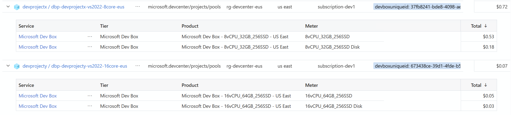

# DevBox のコスト管理

開発ボックスの利用料金は、Windows 365 と異なり、Azure の利用料金の一部として請求されます。課金先は、DevBox プールが属する開発プロジェクトになります。

  

このため、**課金アラートは開発プロジェクトのあるサブスクリプションに対して設定**してください。

課金情報にはタグがついており、このタグが開発ボックス VM の GUID に対応しています。開発ボックスの GUID 値は DevCenter API から調べることができます。（が、簡単にマッチングしたり、過去に作成された開発ボックス VM の GUID 値を調べる方法が現時点ではないようです。。。）

- 例）devboxuniqueid: 443c5d88-d987-4f3d-8b51-35e4c72497d8

```bash

~$ az rest --method GET --uri "${TEMP_DC_URI}projects/${TEMP_PRJ_NAME}/users/${TEMP_USER_OBJ_ID}/devboxes?api-version=2023-04-01" --resource "https://devcenter.azure.com/"
{
  "value": [
    {
      "actionState": "Unknown",
      "createdTime": "2023-09-14T00:02:30.5124876+00:00",
      "hardwareProfile": {
        "memoryGB": 32,
        "skuName": "general_i_8c32gb256ssd_v2",
        "vCPUs": 8
      },
      "hibernateSupport": "Enabled",
      "imageReference": {
        "name": "microsoftvisualstudio_visualstudioplustools_vs-2022-ent-general-win11-m365-gen2",
        "operatingSystem": "Windows11",
        "osBuildNumber": "vs-2022-ent-general-win11-m365-gen2",
        "publishedDate": "2022-09-20T00:00:00+00:00",
        "version": "1.0.0"
      },
      "localAdministrator": "Enabled",
      "location": "eastus",
      "name": "vm002",
      "osType": "Windows",
      "poolName": "dbp-devprojectx-vs2022-8core-eus",
      "powerState": "Running",
      "projectName": "DevProjectX",
      "provisioningState": "Succeeded",
      "storageProfile": {
        "osDisk": {
          "diskSizeGB": 256
        }
      },
      "uniqueId": "443c5d88-d987-4f3d-8b51-35e4c72497d8",
      "user": "25d9f9ad-25c6-418a-9071-2a0eaf86cc4d"
    }
  ]
}

```
