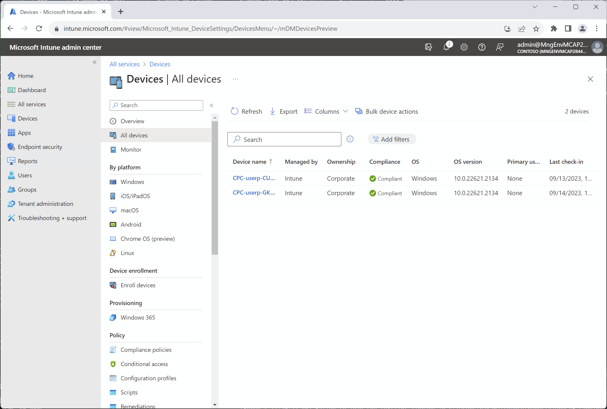

# DevBox のセキュリティ管理

DevBox のセキュリティ管理にはいくつかの側面があります。それぞれについて解説します。

- デバイス (DevBox VM) のセキュリティ管理
- RDP プロトコルのセキュリティ管理
- Azure Security Benchmark への対応

## デバイス (DevBox VM) のセキュリティ管理について

DevBox VM は Windows 365 Cloud PC、すなわちクライアント PC です。このためセキュリティはサーバ用の Defender for Cloud（の中の Defender for Servers）ではなく、クライアント端末用の Intune により管理されます。

  

すでに OA 環境のクライアント PC の管理で Intune を利用している場合には、それに相乗りする形で DevBox VM についても管理する形になります。

## RDP プロトコルのセキュリティ管理について

DevBox VM を利用する際、特に規制業界では、RDP プロトコルを介した情報流出リスクを気にする場合があります。例えばデバイスリダイレクション機能を利用してローカルの USB メモリをクラウド PC につなぐ機能は便利ですが、制限をかけたいと考える場合もあるでしょう。AVD (Azure Virtual Desktop) では、VM プールに対して RDP プロパティを設定することにより容易なカスタマイズが可能でしたが（[Customize Remote Desktop Protocol (RDP) properties for a host pool](https://learn.microsoft.com/en-us/azure/virtual-desktop/customize-rdp-properties)）、Windows 365, DevBox の場合にはこの方法は利用できません。同様のことを行いたい場合にはグループポリシーを作成し、Intune から割り当てることにより実現します。

なお注意点として、開発者用 VM の場合、利用ユーザに対してローカルマシンの管理者権限を与えることが多く、この場合にはグループポリシーを強制的に上書きすることも可能になりますし、他のソフトウェアのインストール・利用など、原理的に様々な方法での不正行動が可能になり得ます。またリモート開発の場合にはモニタをスマホカメラで撮影する、といった古典的な情報漏洩も起こり得ます。このため厳格なセキュリティ管理にはどうしても限界がある、という点も加味しての検討が必要です。

## Azure Security Benchmark への対応について

前述の通り、DevBox VM は Intune により管理され、Azure の VM としては管理されないため、Azure Security Benchmark の影響を受けません。しかし、DevBox を利用するために dev1 サブスクリプション内に作成した Azure Firewall などのリソースは Azure Security Benchmark への準拠が必要です。Azure Security Benchmark を確認し、Remediation, Exemption を適切に行ってください。

```bash

# 業務システム統制チーム／③ 構成変更の作業アカウントに切り替え
if ${FLAG_USE_SOD}; then if ${FLAG_USE_SOD_SP}; then TEMP_SP_NAME="sp_gov_change"; az login --service-principal --username ${SP_APP_IDS[${TEMP_SP_NAME}]} --password '${SP_PWDS[${TEMP_SP_NAME}]}' --tenant ${PRIMARY_DOMAIN_NAME} --allow-no-subscriptions; else az account clear; az login -u "user_gov_change@${PRIMARY_DOMAIN_NAME}" -p "${ADMIN_PASSWORD}"; fi; fi

# ■ 以下は全体に共通
TEMP_MG_TRG_ID=$(az account management-group list --query "[?displayName=='Tenant Root Group'].id" -o tsv)
TEMP_ASSIGNMENT_ID=$(az policy assignment list --scope $TEMP_MG_TRG_ID --query "[? displayName == 'Azure Security Benchmark'].id" -o tsv)

# ■ DDoS Protection 適用の免除（コストのため）

TEMP_EXEMPTION_NAME="Test-Exemption-DDoSProtection"
cat > temp.json << EOF
{
  "properties": {
    "policyAssignmentId": "${TEMP_ASSIGNMENT_ID}",
    "policyDefinitionReferenceIds": [
      "vnetEnableDDoSProtectionMonitoring"
    ],
    "exemptionCategory": "Waiver",
    "displayName": "テスト目的での免除 - DDoS Protection の適用免除",
    "description": "テスト目的での免除 - DDoS Protection の適用免除"
  }
}
EOF
 
TEMP_RESOURCE_ID="/subscriptions/${SUBSCRIPTION_ID_DEV1}/resourcegroups/rg-devhub-${LOCATION_PREFIXS[0]}/providers/microsoft.network/virtualnetworks/vnet-devhub-${LOCATION_PREFIXS[0]}"

az rest --method PUT --uri "${TEMP_RESOURCE_ID}/providers/Microsoft.Authorization/policyExemptions/${TEMP_EXEMPTION_NAME}?api-version=2022-07-01-preview" --body @temp.json

```
