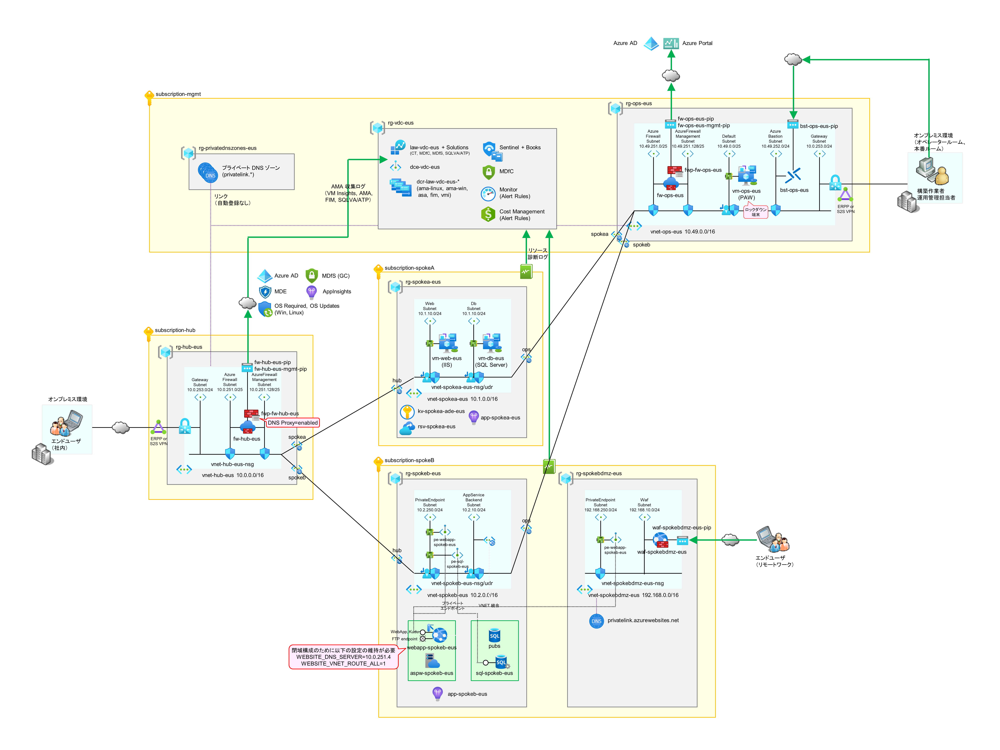
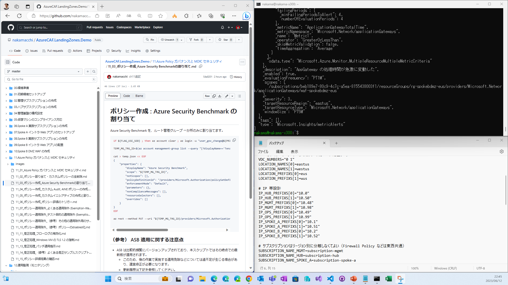
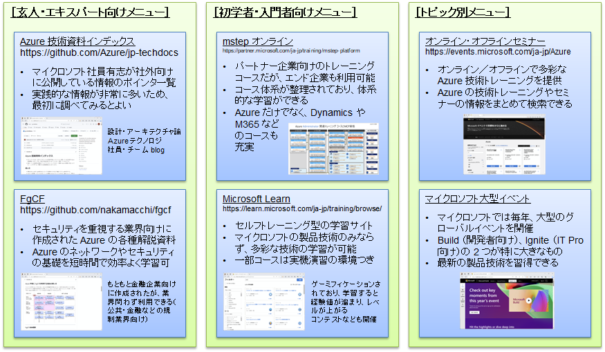

# Azure CAF Landing Zones 設計・構築ガイドライン ＆ ハンズオンデモ

## 本資料について

本資料は、Azure 共通基盤（ランディングゾーン）の設計・構築ガイドラインとそのハンズオン（デモつき）資料です。

- マイクロソフトの公式ガイドラインである Azure CAF と、そのリファレンス実装である ESLZ (Enterprise-scale landing zones, ALZ / Azure landing zones) をベースにしつつ、日本特有の事情を加味して、赤間が作成したものです。日本のお客様に馴染みやすい形で整理しています。
- このデモ一つで、以下の内容がすべて含まれています。（フォルダ番号 00～12）
  - Hub-Spoke VNET 環境（ゼロトラストベースの閉域構成）
  - 動作可能な IaaS Web-DB アプリと PaaS Web-DB アプリを実際に載せる
  - SoD (権限分掌) に基づくカスタム RBAC ロールと実機操作
  - 仮想マシンの完全なセキュア化（MDE, GC, AMA, DA, ASA, CTA 全部入り）
  - Azure Policy, MDfC スコアを 100% にする
  - 運用監視（集約アラートと個別アラート）
- 現在はさらに上記を拡張し、以下も追加サンプルとして掲載しています。
  - AOAI 社内文書検索（Azure OpenAI Service リファレンスアーキテクチャのエンプラ対応版）（フォルダ番号 41～44）
  - CaaS Web-DB アプリ (Azure Container Apps)（フォルダ番号 61～65）
  - DevCenter Deployment Environment によるセルフサービス型サンドボックス環境（フォルダ番号 71～74）
- 本ハンズオン資料をベースにしてご検討いただければ、セキュアかつガバナンスの効いた Azure 共通基盤の構築がかなりラクになる ＆ 速やかにご検討いただけると思います。
  - すでに共通基盤をお持ちのお客様も、セキュリティやガバナンスの強化にご活用ください。

  

各サブスクリプションの位置付けは以下のとおりです。基本サンプルとして上4つ、拡張・追加サンプルとして下6つを用意しています。

| 分類 | subscription | 載せているもの |
| ---- | ------------ | ------------- |
| 基盤 | subscription-mgmt | 運用監視基盤（Log Analytics Workspace, 運用管理端末） |
| 基盤 | subscription-hub | 本番環境用ハブ（Azure Firewall）(※ 本デモでは ER は省略) |
| 業務 | subscription-spoke-a | 業務システムサンプル A（IaaS Web-DB アプリ） |
| 業務 | subscription-spoke-b | 業務システムサンプル B（PaaS Web-DB アプリ） |
| 業務 | subscription-spoke-c | (未定) |
| 業務 | subscription-spoke-d | 業務システムサンプル D（AOAI 社内文書検索） |
| 業務 | subscription-spoke-e | (未定) |
| 業務 | subscription-spoke-f | 業務システムサンプル F（CaaS Web-DB アプリ） |
| 開発 | subscription-dev1 | 開発環境（管理用） (DevCenter, DevBox) |
| 開発 | subscription-dev1 | 開発環境（サンドボックス） (Deployment Environment) |

## Azure 共通基盤の設計・構築の概要を知りたい場合

- 一連の作業スクリプトを、技術説明を織り交ぜながら実行していくデモビデオを以下に用意してありますので、こちらを見るのがオススメです。
- デモビデオはトータルで約 8 時間あります。構築スクリプトを流している待機時間はカットしている一方で、Azure をほとんど知らないユーザにも理解してもらえるように基本的な事項の説明も織り交ぜています。
- どうしても自力で動かしてみたい方は、末尾をご確認ください。

## 作業デモビデオ

※ ビデオ撮影の際、マンション工事が入っており、一部、工事音が入っているところがあります（マイクの収音性能が高いため、稀に子供の声も入ってしまっています）。申し訳ありませんが、ご容赦いただければ幸いです。

| ビデオ | ビデオ時間 | 作業時間目安 | リンク |
| :-- | :-- | :-- | :-- |
|ESLZDemo_00_作業の事前準備|27:57|1 時間|[リンク](https://livesend.microsoft.com/i/KiIa1FQzy1DUXI8U0n7t8Mk08Fb9jKY3D9OXIRgzmtzxN49yn37eJrnD5f1FLIqDji0dQfZDXWsAPEYrpn9qH4S0xuFNa9lIXx9Lt2NEJfn0bo2GrOG48sGCYb1QcjEM)|
|ESLZDemo_01_Step00_環境準備|37:10|1 時間|[リンク](https://livesend.microsoft.com/i/KiIa1FQzy1DUXI8U0n7t8Mk08Fb9jKY3D9OXIRgzmtzWlOQl0ryRu6r1Sn6PLUSSIGNeTdZOx4PklHFnyMPhwzQymXm7tEf___T___aQE3zJTD7tFWQmwRM8BCh6xAXFUu3Hi2IGuVa)|
|ESLZDemo_02_Step01_初期環境セットアップ|37:08|1 時間|[リンク](https://livesend.microsoft.com/i/KiIa1FQzy1DUXI8U0n7t8Mk08Fb9jKY3D9OXIRgzmty3lIBTiHyk___aKePLUSSIGNrkA2HFWaGbK7G9Z9RK1vDfGJnim249___gyoafziCsydTeqFwGLOeyW0Nt1cMo5iYJBG4UuLK)|
|ESLZDemo_03_Step02_管理サブスクリプションの作成（前半）|41:05|2 時間|[リンク](https://livesend.microsoft.com/i/KiIa1FQzy1DUXI8U0n7t8Mk08Fb9jKY3D9OXIRgzmtyuIJHJGxHlXyruUKSZFgoiqoFQtKM6WGa10g0wqigG8cHQR___uaePLUSSIGNR9z7PAyAeXXSzesby___8TNKxHk62WCS2GjO)|
|ESLZDemo_04_Step02_管理サブスクリプションの作成（後半）|10:03|1 時間|[リンク](https://livesend.microsoft.com/i/KiIa1FQzy1DUXI8U0n7t8Mk08Fb9jKY3D9OXIRgzmtzNFsLwDgF7pYpQiEpJcyCweH5A5cPLUSSIGNY2uXXOZkdcKBgnPl4OV0EZTIrP5KYzb7aiH5m2cxJODFpfd9P4lB6WiTt)|
|ESLZDemo_05_Step03_ハブサブスクリプションの作成|03:18|1 時間|[リンク](https://livesend.microsoft.com/i/KiIa1FQzy1DUXI8U0n7t8Mk08Fb9jKY3D9OXIRgzmtzxN49yn37eJrnD5f1FLIqDbPLUSSIGNPvjzSMxMSUEUBuXMUsYoGrCnsnKD5oxJ5TUqaACKvon6ewZ4tGMhTc6t6tj8j0)|
|ESLZDemo_06_Step04_管理基盤の構成設定|28:40|1 時間|[リンク](https://livesend.microsoft.com/i/KiIa1FQzy1DUXI8U0n7t8Mk08Fb9jKY3D9OXIRgzmtwb9ehaqUR1bVgNjwxUn8lZ67jW3rgXfFbLq218H___G2aegx9BiqJlzdJz2YIMNsvbSJjaXZydgEvBKD6lJRlRi8)|
|ESLZDemo_07_Step05_仮想マシンのコンプライアンス対応|44:26|2 時間|[リンク](https://livesend.microsoft.com/i/KiIa1FQzy1DUXI8U0n7t8Mk08Fb9jKY3D9OXIRgzmtyuIJHJGxHlXyruUKSZFgoiXIXOZV1xgqlaxE8xRWGe___UO3627judlDM3UnmqX12p7IlXq0GbS47AhbjnOK___jsL)|
|ESLZDemo_08_Step06_SpokeA_IaaS型WebDBインフラの作成|25:22|2 時間|[リンク](https://livesend.microsoft.com/i/KiIa1FQzy1DUXI8U0n7t8Mk08Fb9jKY3D9OXIRgzmtxc0hP9Z1kKTECqbtEgiraQlsD1sM1Ok0zH9nZkpDSN___x7gKeOpxawUKFn532drkexZmq2zohKkQVenXIdrIcC___)|
|ESLZDemo_09_Step07_SpokeA_イントラWebアプリのセットアップ|47:08|3 時間|[リンク](https://livesend.microsoft.com/i/KiIa1FQzy1DUXI8U0n7t8Mk08Fb9jKY3D9OXIRgzmtxQXPLUSSIGN___dalE8F4n68O7GPED3c0FWx0wdeHVe2V7AzflG___EFx76Vn7___V8NiGKXEuCH8lt1EOWCZBD5WPLUSSIGN378pUcFHe)|
|ESLZDemo_10_Step08_SpokeB_PaaS型WebDBインフラの作成|30:11|1.5 時間|[リンク](https://livesend.microsoft.com/i/KiIa1FQzy1DUXI8U0n7t8Mk08Fb9jKY3D9OXIRgzmtw6G7iQYzLWpOMJ73X83AsFq5y8eAuxNsapqnLIkTPNWf0qCrPLUSSIGN3d5dlZg5czcrTqZ3___vhhYf9e6r___nU5ZTrtrcv)|
|ESLZDemo_11_Step09・10_SpokeB_WebアプリのセットアップとDMZWAFの作成|24:47|1 時間|[リンク](https://livesend.microsoft.com/i/KiIa1FQzy1DUXI8U0n7t8Mk08Fb9jKY3D9OXIRgzmtwb9ehaqUR1bVgNjwxUn8lZggMKPLUSSIGNk7fN8B___kaWnKpiiBjRvGIuiH0xJ63d9Jmu2g7NvcAqNmRmtTayPyQZNC3UI)|
|ESLZDemo_12_Step11_AzurePolicyガバナンスとMDfCセキュリティ(前半)|25:31|1 時間|[リンク](https://livesend.microsoft.com/i/KiIa1FQzy1DUXI8U0n7t8Mk08Fb9jKY3D9OXIRgzmtwb9ehaqUR1bVgNjwxUn8lZJY93mIkPLUSSIGNHatQRQSxegbvacyTFt1o8tnNqk5MRXKd___SbqHC66JpMmg4M5cPLUSSIGNre3ucR)|
|ESLZDemo_13_Step12_AzurePolicyガバナンスとMDfCセキュリティ(後半)|45:51|2 時間|[リンク](https://livesend.microsoft.com/i/KiIa1FQzy1DUXI8U0n7t8Mk08Fb9jKY3D9OXIRgzmtzxN49yn37eJrnD5f1FLIqDhRuH4JlKw3PLUSSIGNcectKpgiH3FI9E24p60lLuqBOHcs2lCyPLUSSIGNZX5Vjg2ojWlrIQz1Pxfc)|
|ESLZDemo_14_Step13_運用監視（モニタリング）|34:41|1 時間|[リンク](https://livesend.microsoft.com/i/KiIa1FQzy1DUXI8U0n7t8Mk08Fb9jKY3D9OXIRgzmtzxN49yn37eJrnD5f1FLIqDqmTK8rH9sN7GlJnK7vj6v06iDkoPOcMtwlIk2i6kSIlz6jAKieqAdRhALIhmiohR)|
|ESLZDemo_15_後片付け方法とまとめ|11:24|1 時間|[リンク](https://livesend.microsoft.com/i/KiIa1FQzy1DUXI8U0n7t8Mk08Fb9jKY3D9OXIRgzmtxc0hP9Z1kKTECqbtEgiraQzNcjPLUSSIGNYw78qwv56E4LPcO6jbmVDVsb6aEqZvRzkI0___aJRTiV5DYoFUVPLUSSIGN9uYEd7Oeb)|

## 関連資料

- Azure CAF ってそもそも何？みたいな方は、超訳 Azure CAF のビデオをご確認ください。（約2.5hのビデオで、実践的な観点から Azure CAF を読み解きます。）
- Azure 共通基盤の設計方法をより深く学びたい方は、Azure 共通基盤設計ガイドを見てください。
- その他、Azure の個々の技術トピックを知りたい方は、jp-techdocs をご確認ください。

| 資料名 | リンク |
| :-- | :-- |
| 本デモビデオで利用している解説資料 | [ppt](https://livesend.microsoft.com/i/KiIa1FQzy1DUXI8U0n7t8Mk08Fb9jKY3D9OXIRgzmty3lIBTiHyk___aKePLUSSIGNrkA2HFWWrR8VvyRuWQPLUSSIGN52pEYERsWu4iOrKNzV7UrsexQvun6pO6pBDPJ89k2nd9eGgvMNWo) |
| Azure 共通基盤設計ガイド | [ppt](https://livesend.microsoft.com/i/KiIa1FQzy1DUXI8U0n7t8Mk08Fb9jKY3D9OXIRgzmtyy___E9hoB___Jl5X2cG___eFg9xZs017DXdoHTy9fn4yYVLPLUSSIGNFXTyy5PLUSSIGNS14p0PLUSSIGNmFpjO3IMyMfU0fsLySs2___VfgpCKqbQ) |
| Azure 共通基盤設計 ガバナンス設計 Excel シート | [xls](https://livesend.microsoft.com/i/KiIa1FQzy1DUXI8U0n7t8Mk08Fb9jKY3D9OXIRgzmtzPLUSSIGNCTjNOOGXNMVZD4DcEWrE64Syy7H6UHhao19mGQ6SdMhQ1___l4rEsmMFXZmgWJvVjoxOI5K7mwavHIsfJFxyRF) |
| 超訳 Azure CAF | [ppt](https://download.microsoft.com/download/2/a/b/2ab69a5d-7c69-4a24-a692-50823e3255d6/Translations_AzureCAF_v0.11.pptx) [前半](https://www.youtube.com/watch?v=eHLpPk6P8hw&t=10s) [後半](https://www.youtube.com/watch?v=RwAtcn75_7A&t=0s) |
| Azure jp-techdocs | [リンク](https://github.com/Azure/jp-techdocs) |

## どうしても自力でやってみたい場合

### 実機演習のために必要な環境

自力で動かしてみたい場合、実習に必要な機材は以下の 3 つです。（1作業者につき①～③が1セット必要です。）

- ① 新規作成したテスト用の Azure AD テナント
- ② テスト環境を作成する Azure サブスクリプション 4 つ
- ③ テスト環境の作成スクリプトを順次実行するための端末

それぞれ以下に補足します。

### ① 新規作成したテスト用の Azure AD テナント

今回の演習では、テストユーザを作成して権限割り当てを行うなど、Azure 環境全体の管理も行います。このため、すでにお使いの Azrure AD 環境内での演習作業は絶対に行わないでください（既存のリソースやポリシーを一括で削除するようなスクリプトを流す作業もあります）。必ず新規に Azure AD テナントを作成し、そこで演習を行うようにしてください。

### ② テスト環境を作成する Azure サブスクリプション 4 つ

今回の演習では大規模な Azure 環境を模倣するため、管理サブスクリプション、ハブサブスクリプション、業務システム用サブスクリプション2つ、合計4つのサブスクリプションを利用します。これらのサブスクリプションは、現在お使いの EA 契約から作成されたサブスクリプションで構いませんが、必ず①のAADへの付け替えを行ってください。（※ Spoke D, F, DevCenter なども確認したい場合には、最大 10 個のサブスクリプションがあると便利です。）

なお、EA 契約からサブスクリプションを作成した場合、サブスクリプションは作成者のホームAADテナントに自動的に紐づきます。このため、テスト用にサブスクリプションを新規に作成するのであれば、①のAADアカウントをEA契約のアカウント管理者として登録し、そのアカウントでサブスクリプションを新規作成すると簡単です。

### ③ テスト環境の作成スクリプトを順次実行するための端末

実機演習には、一連の bash スクリプトを動かすための操作端末（演習端末）が必要です。この端末は、Windows 端末に WSL2 をセットアップし、ツール（az cli）をインストールして準備いただく必要があります。
また、この Windows 端末からは、ブラウザを介して Azure Portal にアクセスして①②を利用しますが、イントラネット端末や社内ネットワークでは①②を自由に操作できない可能性があります。このため、独立した端末をご準備いただくなどの工夫が必要になる場合があります。

### 費用について

今回のテスト環境には比較的高額なリソースをいくつかデプロイします。（Azure Firewall, AppGateway など）　立てっぱなしにした場合、いずれも月額で数十万円かかるリソースです。こうした高額リソースを一時的に停止するスクリプトもご用意しておりますが、短期集中的に学習いただき、終了後はすみやかに環境削除することをおすすめします。

### 作業者と環境セットについて

前述の通り、①～③は 1 作業者につき  1 セットが必要です。本資料をワークショップなどで利用する場合、人数分の環境セットをご用意いただくのは、コストなどの観点で非現実的な場合もあります。このような場合には、2～3 人ごとにチームを組んでいただき、1 チームあたり 1 セットとして、ペアプログラミング形式で実習していただくことをおすすめします。トラブルシュートもしやすくなりますし、理解も深まりやすいと思います。
（コストの理由から 1 つの環境をみなさんでご覧いただく、という形にしているケースもありました。）

作業の際はマルチモニタを利用し、片方のモニタでビデオを流しつつ、もう片方のモニタをスクリプト貼り付け用に利用していただくと作業しやすいと思います。（ブラウザの拡大率を変更して縮小し、GitHub のフォルダビューを出していただくと、bash への貼り付けを容易に行っていただけると思います。）

  

## 制限事項・免責事項

本資料の使用においては、次の制限、制約をご理解の上、活用ください。

- 目的外利用の禁止\
本資料は Microsoft Azure 上において、システムやソリューションの円滑かつ安全な構築に資することを目的に作成されています。この目的に反する利用はお断りいたします。
- フィードバック\
本書の記載内容へのコメントやフィードバックをいただけます場合は、担当の日本マイクロソフト社員にご連絡ください。なお、個別質問への回答やフィードバックへの対応はお約束できないことを、ご了承いただけますようお願い申し上げます。
- 公式情報の確認\
本資料は日本マイクロソフトの有志のエンジニアによって、現場での経験を加えて開発されたものです。そのためこの内容は Microsoft として公式に表明されたものではなく、日本マイクロソフトおよび米国 Microsoft Corporation は一切の責任を負いません。また、本書の記載内容について Azure サポートへお問い合わせいただいても、回答することはできません。Microsoft Azure の公式情報については、Azure のドキュメントをご確認ください。
- 免責\
本資料は、アーキテクトやエンジニアの皆様に向けた技術情報のご提供を目的としています。コンテンツの内容について何ら保証するものではなく、使用に関連してお客様、お客様の関連会社、または第三者に生ずる間接的、付随的、結果的な損害（営業機会や営業情報の損失などを含む）について一切責任を負いません。

※ 特に、サンプルスクリプトの中には、環境内のリソースや設定をまとめて一括削除するクリーンアップ処理なども含まれています。くれぐれも十分にご注意のうえ、内容を理解した上でご利用・ご活用ください。

## （参考） 設計・構築支援サービスについて

本サイトのコンテンツや資料に関しては、基本的に「読めばわかる」「ほぼそのまま使える」ように作っている（つもり）です。このため、もしエンドユーザ企業様が Azure 共通基盤の構築・強化が必要と感じた場合には、基盤を担当されているベンダー様に本コンテンツをご紹介いただき、これに沿った構築・強化を二人三脚で進めていただければと思います。

その際、どうしても Azure 共通基盤の設計・構築に関する支援が必要になった場合には、マイクロソフトの Unified Support の中で設計・構築支援サービスメニューをご用意しています。また、マイクロソフトのサポート部門からの直接支援だけでなく、弊社パートナー企業様からのご支援も可能な場合があります。ご興味がある場合には、弊社担当営業までご相談ください。

また関連して Azure の技術を深く知りたい場合や基礎知識を強化したい場合には、以下のコンテンツがお薦めです。（いずれも無料で利用できます）　ぜひご活用ください。

- [Azure 技術資料インデックス](https://github.com/Azure/jp-techdocs)
- [FgCF](https://github.com/nakamacchi/fgcf)
- [mstep オンライン](https://partner.microsoft.com/ja-jp/training/mstep-platform)
- [Microsoft Learn](https://learn.microsoft.com/ja-jp/training/browse/)
- [オンライン・オフラインセミナー](https://events.microsoft.com/ja-jp/Azure)

  

## （参考） マイクロソフト社員の方へ

MS 社員が社内環境を使って作業する際の注意事項メモを別途まとめてあります。必要な場合は赤間（nakama）までご連絡ください。
